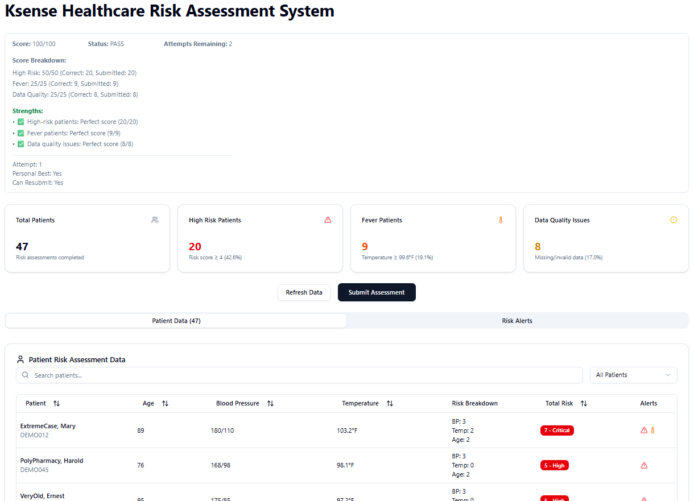

# Ksense Healthcare Risk Assessment System

A patient risk scoring platform built for the Ksense Healthcare API Assessment. This application demonstrates API integration, data processing, and full-stack development skills using modern TypeScript and Next.js.

## 🚀 Live Demo

**[View Live Application →](https://ksense.vercel.app)**

## 📋 Assessment Overview

This project implements a patient risk scoring system that:

- Fetches patient data from a healthcare API with retry logic and error handling
- Calculates risk scores based on blood pressure, temperature, and age
- Identifies high-risk patients, fever cases, and data quality issues
- Provides an intuitive dashboard for clinical decision making

## 🏗️ Technical Architecture

### Frontend

- **Next.js 15** with App Router and React Server Components
- **TypeScript** for type safety and developer experience
- **Tailwind CSS** + **shadcn/ui** for professional styling

### Backend Integration

- **Custom API client** with exponential backoff retry logic
- **Rate limiting handling** (429 responses)
- **Error recovery** for intermittent 500/503 failures
- **Data validation** with graceful fallbacks

### Key Features

- ✅ **Robust error handling** - Handles API inconsistencies gracefully
- ✅ **Real-time progress tracking** - Visual feedback during data fetching
- ✅ **Advanced filtering & sorting** - Search patients, filter by risk level
- ✅ **Risk visualization** - Color-coded badges and alert systems

## 🏆 Assessment Results

Successfully implemented all required features:

- ✅ API integration with retry logic
- ✅ Risk calculation algorithm
- ✅ High-risk patient identification
- ✅ Fever patient detection
- ✅ Data quality issue flagging
- ✅ Professional UI/UX design

**Perfect Score Achieved: 100/100 on First Attempt**

